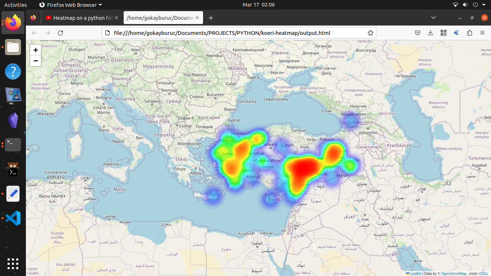
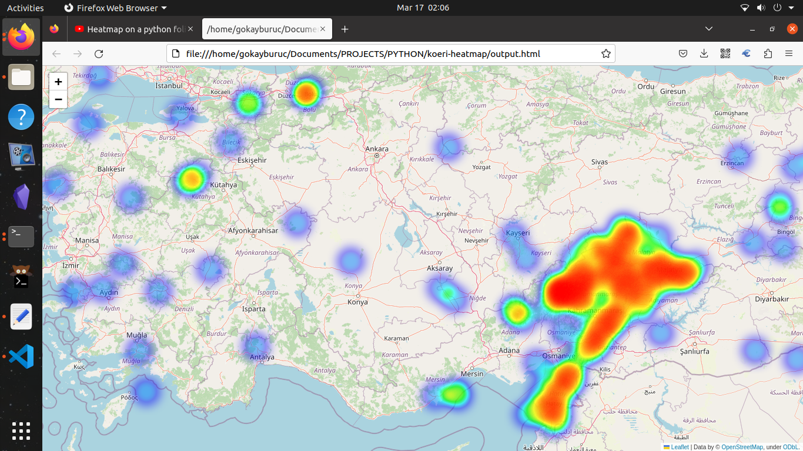

# koeri-heatmap


## Introduction 

This project was developed to create an earthquake heat map using python folium, bs4, requests and pandas libraries. It is open source and not for commercial purposes.

Earthquake source data was taken from [http://www.koeri.boun.edu.tr/scripts/lst0.asp](http://www.koeri.boun.edu.tr/scripts/lst0.asp).

When the project runs, an  `output.html`   file is displayed on the screen in the browser.

## Screenshots




## Resources

The official documents I used in this projects are shared below: 

- [Folium](https://python-visualization.github.io/folium/index.html)
- [Heatmap](https://python-visualization.github.io/folium/plugins.html?highlight=heatmap#folium.plugins.HeatMap)

## Location Info

In order to create a heatmap on Folium, map boundaries were obtained from the following web page as geolocation.

[LocationInfo](https://www.distancesto.com/coordinates/tr/turkey-latitude-longitude/history/3603.html)

| Location Term     | Value              |
| ----------------- | ------------------ |
| Turkey Latitude:  | 38.963745          |
| Turkey Longitude: | 35.243322000000035 |

## Requirements 

Required Libraries are: 

- [folium](https://python-visualization.github.io/folium/latest/)
- [bs4](https://beautiful-soup-4.readthedocs.io/en/latest/)
- [requests](https://requests.readthedocs.io/en/latest/)
- [rich](https://github.com/Textualize/rich)
- [pandas](https://pandas.pydata.org/)

## Usage

When you run the file below, the necessary Python libraries will be installed automatically. Afterwards, data will be extracted from the page and a file named `output.html` will be created. `output.html` will open and the earthquake heatmap page will appear on your screen.


```bash 
bash koeri.sh 
```
## Todo 

- [ ] Pages with asp extension vary between 1 and 10. Page changing regulation regarding this will be added.
- [ ] exe file will be created with `pyinstaller`.

## Reach Me 

How to reach me : [gokayburuc@yandex.com](mailto:gokayburuc@yandex.com)

